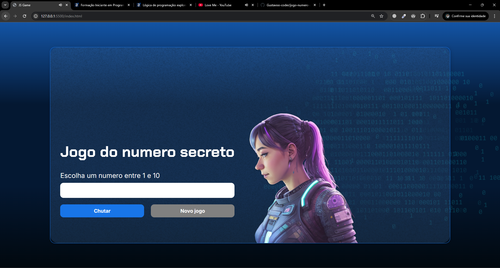

# 🎲 Jogo do Número Secreto - V2

Projeto baseado em um desafio da *Alura*.  
O *HTML e o CSS* foram fornecidos pela plataforma, e eu desenvolvi a *lógica em JavaScript*, além de implementar novas funcionalidades.

## ✨ Funcionalidades

- ✅ Geração de número secreto aleatório  
- ✅ Interação com o usuário via interface  
- ✅ Validação de tentativas  
- ✅ Código refatorado e organizado em *funções*  
- ✅ *Suporte a voz* (uso da API ResponsiveVoice.)  

## 🛠 Tecnologias Utilizadas

- *HTML5* (base fornecida pela Alura)  
- *CSS3* (base fornecida pela Alura)  
- *JavaScript* (lógica desenvolvida por mim)  

## 📸 Preview

## 🌐 Deploy

O projeto está disponível online:  
👉 [Acessar o jogo no Vercel](https://jogo-numero-secreto-voz-rho.vercel.app/)
